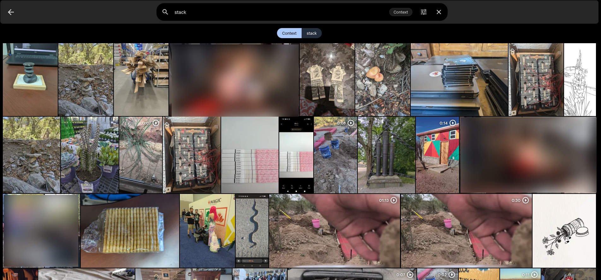
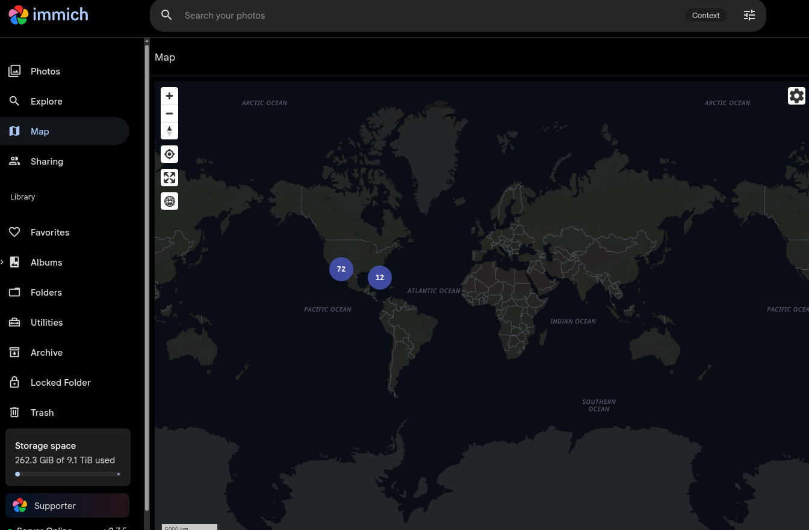
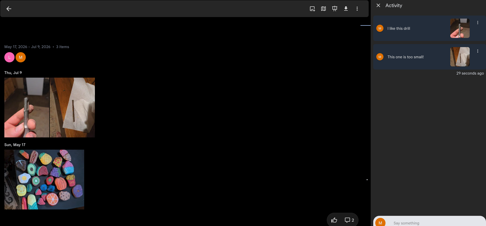
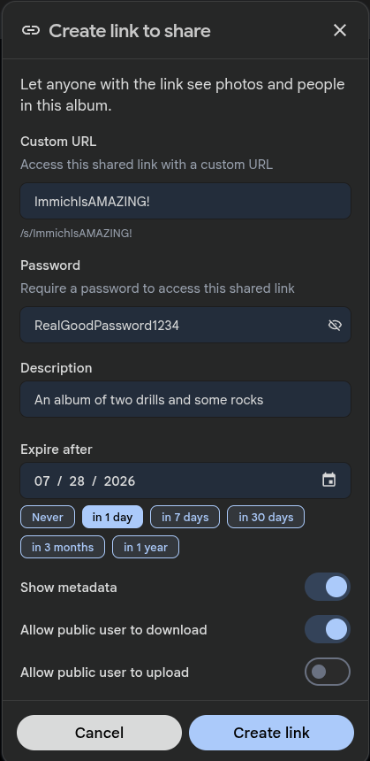

This is just a collection of interesting open source tools, so that I don't forget them, and other people can see how cool they are!

## Is Open Source Safe
The short answer is yes, it is as safe or safer than closed source software. The long answer is...kinda, no software is completely secure! There will always be bugs, and exploits, etc. Are those more likely to be discovered in open source software? Definitely! But they're more likely to be discovered by someone who means well. With closed source software the only people who could discover those exploits are people who are actively trying to exploit it, or the original writers of the code! With open source anyone can look at my code and tell me that they think it has a vulnerability! And anyone can fix that vulnerability!

Closed source software likely has more bugs and vulnerabilities, but they're slightly harder to find. But one of the main confusion points on this topic is the idea that just because something is public knowledge, it is less secure. That's not true, and the best security algorithms are open! All of the best and most widely used and trusted encryption algorithms are open source! This isn't seen as a risk, but as a benefit! Anyone in the world can review the algorithm for vulnerabilities! And yet it's still secure because that's what the algorithm is made to do! Just because you know how keys and locks work, doesn't mean that the key for my door is useless now! Assuming that it was intricate and random enough, no matter how much you knew about the process, you couldn't open my door without my key! And anyone in the world can inspect the locking mechanism to be sure that there are no flaws!

## Is Open Source Beneficial
One of the most influential and valuable pieces of open source software ever created is what I am currently using while writing this post! Linux is the backbone of the computing world! Most servers run on it! And it is completely Free and Open Source Software (FOSS)! Anyone can see all the code! From the oldest, and most important core functions. To the newest cutting edge algorithms! And anyone with the skill and desire, can contribute to making it better!

The creator of Linux, Linus Torvalds has been asked if he regrets making it open source since hundreds, maybe thousands of other companies have made billions off of his work! Android is built on top of Linux, Red Hat Linux is an enterprise distribution of Linux that is built on top of Linux and sold to the government and businesses for ludicrous subscription fees! Almost every (96%) server on the internet runs some distribution of Linux since it is a much leaner, faster, and easier to maintain system! And all the AI stuff is run on Linux, again because it's leaner, faster, and better suited for development! Even Microsoft admits that it's better! Microsoft runs its own cloud service, Azure, on mostly Linux! They released their own distribution of Linux too so that at least they can say that they run their cloud on Microsoft branded Linux!

Despite all that, when asked if he regrets releasing Linux for free for everyone, with no strings attached, he said no! He still is the project lead for Linux! He is still maintaining it, for free! And anyone can take it, use it, improve it, or sell it without paying him anything!

### Viral licenses
There are various open source licenses, that give varying degrees of freedom to those who utilize the software! There are totally open licenses like the Unlicense which explicity says you can do whatever you want with this, just don't come looking to me for liability or warranty! The MIT license is similar except it requires that you include the license and copyright attached to the source code, so just give credit to the original creator for their code! Other than that do whatever you want! There's the Apache 2.0 License which requires the same as MIT excpet you also must state when you've changed the original file! Those are all very permissive. There is another form of open source licenses called Copyleft licenses, or viral licenses! They are called that because they require the user of the software to copy the license in any software that uses the tools! Hence Copyleft since copyright usually only applies to product in question, but these apply to any derivative, they're copying their license onto anything that uses them! That's also why they are called viral licenses! The most well known of these is called GNU GPLv3 and it allows you to do whatever you want with the code including commercial use, but any code that uses the GPLv3 license must be licensed as GPLv3 as well! And you must adhere to all the requirements of the previous licenses but this also requires that you disclose the original source.

Opponents of Copyleft licenses often criticize that they are overly restrictive and against the philosophy of open source since they do not allow people to freely use and incorporate your code without being required to give away all of their code too!

Proponents of these licenses however point out that it's simply enforcing the reciprocal benefits of open source! If one team provides something excellent for free, and another team leverages that into something even better then it should also be shared, so that the first team can benefit and perhaps a third team can come and leverage it again to something even greater!

I tend to lean toward the copyleft viewpoint. The power of open source is that we all contribute and improve on it! If one person only takes from the open source community and never contributes it will survive. But if massive companies benefits off of the volunteered time and skills of the open source community without ever giving back, it could tip the scale too far and cause open source itself to suffer! 

The copyright mindset comes partially from physical scarcity! In the physical world it costs a lot to research and prototype something, and then it costs WAY MORE to start mass producing that thing and marketing it and selling it. During that whole time I need to be protected from others coming in and stealing my idea and profiting off of it before I can get the infrastructure up and running to capitalize on it. But in the digital world it costs almost nothing to copy a program! I can make a million copies and share it with everyone in the world in hours! And if someone else does the same thing but a little bit better, that doesn't destroy me! I just take their contributions with gratitude and then together we keep building something that's amazing and that people will want to pay for! Sure there can still be bad deals and people stealing other's ideas to try and profit off of them, but it can, and should be a problem that is shrinking, and copyleft is one way of enforcing that mindset. I'm not hoarding my knowledge. I'm taking advantage of the excellent software that is available, adding my own contributions, and growing everything together! There are other ways to make money than by withholding beneficial tools!

Here's a quick short list of license examples: [https://choosealicense.com/licenses/](https://choosealicense.com/licenses/)

## Immich
Immich is a FANTASTIC tool! One of the smoothest, and most feature loaded apps I've ever used! And it's totally free!

Not so long ago, my wife, my sister, and my aunt all came to me within the span of a month and asked me if I knew of anything that could help them replace Google/Amazon/Microsoft photos! My sister and my aunt did this because they had filled their limited quota of free storage and since their email was stored in the same bucket apparently, they could no longer receive emails unless they deleted their pictures or paid for more storage! I don't know about you, but I think that's pretty scummy! These companies offer you free storage for you pictures, they nag you about it constantly if you don't backup your pictures with them, and when you do they stop letting you receive emails, send scary warnings like "Your pictures may be deleted if storage is not expanded soon", and more as soon as you hit 5 or 10 gigs!?

As if all that wasn't enough, they sell and train models on your pictures, videos, and emails! Even if you pay they STILL sell all your data!

One of the main ways that they keep people trapped is convenience! Sure you know that Amazon charges you more than it would cost to store your photos yourself, but they have an easy app, and you can see your gallery from you computer, or your phone anytime! Plus they have fancy feature like facial recognition, searchable images, and easy image sharing.

That's why I was SO impressed with Immich! It is BETTER than any paid photo storage I've seen! The app is great, it handles backups super easily, installing the server is super easy thanks to Docker, and the extra features are awesome! 

It has facial recognition which you can filter images by to only show pictures of a specific person.

It has context searching where you can tell it a word and it will show you images with that word related! Miriam and I were wondering how long it had been since we went to the Grand Canyon. She started skimming through her timeline, and just out of curiosity I hopped on Immich and search Grand Canyon. BOOM! First picture was us taking a selfie in front of the Grand Canyon! It's honestly a little scary, but it's a good reminder! Big companies are doing this with our data whether they tell us or not! They can already search through your whole life for any images with a gun, or scan the year 2020 for maskless pictures, or pictures of you at a protest! Seems a little too easy but at least now it's working to benefit you, on your server, not sending or selling it to anyone!

If your pictures have location data (*You can enable that in your camera app, but it's a privacy risk if you post those photos online or even back them up somewhere you don't trust*) then you can switch to the map view in Immich and click to see all your picture from that trip to Germany!

It has incredible sharing features! If you both have accounts on your instance of Immich then you can mark someone as a partner, and that automatically shares all your photos with them! You can choose whether or not those show up in your timeline with your photos too! But maybe that's too much sharing, well you can also create and share albums. If you share with other Immich users you can comment on photos in the album.

Or you can generate a url that is accessible to anyone who can reach you server, whether they have an account on your Immich instance or not! Look at all these cool options!

You can choose your own name for the URL instead of having it be random letters and numbers! You can set a password if you want, or just leave it open! You can set the link to expire after a period of time, and you can choose what people can do with the link, upload, download, and whether or not they can see metadata, which includes the location data for the photos if it exists. Now do keep in mind that this is not foolproof there are ways to download the images even if the website doesn't offer it so I wouldn't go handing out keys to your private photo stash regardless but it's pretty cool!

And did I forget to mention that this is all running on a TINY computer? This computer specifically: [https://www.amazon.com/GMKtec-G5S-Compact-Celeron-LPDDR4/dp/B0H4TCY6TH?ref_=ast_sto_dp](https://www.amazon.com/GMKtec-G5S-Compact-Celeron-LPDDR4/dp/B0H4TCY6TH?ref_=ast_sto_dp) That tiny little computer and one command lets me run the webserver, the AI component for context searching, and facial recognition, and the database for storing all that cool stuff!

I am proud to say that I did actually purchase Immich! Doing so changed nothing about my actual user experience (*Except the cool little supporter icon you can see in the map photo*) but they have already saved my family hundreds of dollars that would have gone to Amazon, Google, and Microsoft for their stupid storage solutions that will only get worse! This way I can support the development of a software that I like, and dumb as it sounds, since I didn't have to pay for it I really enjoyed buying it! And now everytime that I see that **Supporter** icon I feel happy knowing that I supported a cool project that I love, and that I am helping save my family money and their privacy!

Immich is licensed under GNU AGPLv3! Which is one of the most agressive copyleft licenses! Even if your tool interacts with Immich over the network it must be GNU AGPLv3 licensed as well! Because of that there are numerous Immich tools that are built to improve on various facets of Immich which are also open source! It also means that Amazon, Google, Microsoft, etc. can never take Immich and use it as their own thing without making all changes open source. So we could see any paywalls, personal data collection, or other stupid stuff that they might add!

Here is their website if you want to see what they are all about: [https://immich.app/](https://immich.app/)

And here is their github where all the code is hosted free for anyone: [https://github.com/immich-app/immich](https://github.com/immich-app/immich)

## Docker

I mentioned Docker a few times in the previous section and it will come up again in just about every other section! For those of you who have not heard of Docker, it's a kind of virtualization software that lets you run programs as if they were the only thing running on your computer. This can help with dependencies and security by providing isolation between programs, they can use the same ports, the same database programs, the same everything pretty much, and run on the same computer without being able to see or mess with each other! For those that are familiar with Docker and hate it, it is not a solution to every problem. In fact it's probably not the best solution to any problem. But it is a great solution to the issue of easy installation, management, updating, and uninstalling. For those who are familiar with Docker and love it, I'm honestly kind of with you! But again it's not a perfect solution to everything! However when it comes to easy set up for homelabs it's amazing!

I have Immich running and I just used the Docker Compose (*Which is a scripting language for Docker*) that Immich provided, then I just run that, and it downloads the images and starts all the containers I need! (*Containers is what Docker creates*) I didn't install any other dependencies on my machine, and if I ever want to uninstall Immich I just remove that folder, the containers, and the images, and that's it! But I also have Copyparty running for a network file share. It has it's own dependencies, some of which are the same as Immich but rather than setting them both up to talk to the same database and making sure that they don't step on each other, Docker lets me just spin up a database for each of them.

Obviously since Docker duplicates dependencies it takes up more storage than a well installed and managed system would. But for beginners, or people who have more computing resources than time, it's a worthy trade!

Their open source is a bit scattered but here are some links to get started!

[https://github.com/docker](https://github.com/docker)

[https://github.com/containerd/containerd](https://github.com/containerd/containerd)

[https://github.com/moby/moby](https://github.com/moby/moby)

## TapMap
[https://github.com/olalie/tapmap](https://github.com/olalie/tapmap)

{{ <comments> }}